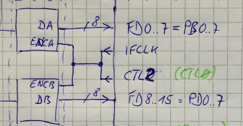

# HowTo: Create GPIF waveform files for the `gpif-compiler`

The examples in this directory are based on the real hardware of the Hantek6022BE, this is a cheap digital storage scope.
It consists mainly of an EzUSB with a dual channel 8-bit ADC [AD9288](https://www.analog.com/media/en/technical-documentation/data-sheets/AD9288.pdf).
The ADC can operate on variable clock frequencies (20kHz..48MHz) coming from either the IFCLK or CTL2 output of the EzUSB to sample signals of different speeds.

## Hantek6022 ADC backend

## CTLx setting
These values need to be set globally once at device init.

	GPIFIDLECTL = 0x00; // Don't enable CTLx outputs
	GPIFCTLCFG = 0x80;  // TRICTL=1. CTL0..3: CMOS outputs, tri-statable

## IFCONFIG settings
To be adapted individually for each sample rate, IFCONFIG[7..5] can be set by pseudo opcodes.

	// IFCONFIG.7 : IFCLKSRC, 0: ext, 1: int (30/48 MHz)
	// IFCONFIG.6 : 3048MHZ,  0: 30MHz, 1: 48MHz
	// IFCONFIG.5 : IFCLKOE,  0: tri-state, 1: drive
	// IFCONFIG.4 : IFCLKPOL, 0: normal polarity, 1: inverted
	// IFCONFIG.3 : ASYNC,    0: synchronously, ext. clock supplied to IFCLK pin,
	//                        1: asynchronously, FIFO provides r/w strobes 
	// IFCONFIG.2 : GSTATE,   1: PE.[10] = GSTATE.[10]
	// IFCONFIG.[10] :       00: ports,
	//                       01: reserved,
	//                       10: GPIF (internal) master,
	//                       11: slave FIFO (external master)

## Timing definition examples for different sample rates

	//
	// The program for fastest speed 30/48 MS/s is:
	// jump 0,  CTL2=Z, FIFO, LOOP
	//
	// The program for 24 MS/s (@48MHz) or 16 MS/s (@30MHz) is:
	// wait 1,  CTL2=0, OE2=1, FIFO
	// jump 0,  CTL2=1, OE2=1
	//
	// The program for low-speed, e.g. 500 kS/s (@30MHz), is:
	// wait 30, CTL2=0, OE2=1, FIFO
	// wait 29, CTL2=1, OE2=1
	// jump 0,  CTL2=1
	//
	// The program for very low-speed, e.g. 20 kS/s (@30MHz), is:
	// wait 250, CTL2=0, OE2=1, FIFO
	// wait 250, CTL2=1, OE2=1
	// wait 250, CTL2=1, OE2=1
	// wait 250, CTL2=1, OE2=1
	// wait 250, CTL2=1, OE2=1
	// wait 249, CTL2=1, OE2=1
	// jump 0,   CTL2=1
	//

## Sample waveform files

My naming convention from the real application is: 
- all Mega-sample-values are simple numbers, e.g. 1MS/s -> 1, 16 MS/s -> 16
- all kilo-sample-values are 100 + k-sample-value/10, e.g. 500 kS/s -> 150, 20 kS/s -> 102

### 30 MS/s waveform file example
Save this as `gpif_30.wvf`

	.WAVEFORM       30              ; Name this waveform

	.TRICTL         1               ; Assume TRICTL=1

	.IFCLKSRC       1               ; feed internal 30/48 MHz clock to the GPIF
	.3048MHZ        0               ; select 30 MHz
	.IFCLKOE        1               ; IFCLK active output drives the ADC

	JD*     RDY0 AND RDY0 $0 $0                     ; 1 cycle, CTL2 tri-state, repeat, jp 0
	                                                ; 1 cycle total @30MHz -> 30 MS/s

Execute `gpif_compiler < gpif_30.wvf > gpif_30.inc` to create the C include file `gpif_30.inc`

	const unsigned char ifconfig_30 = 0xaa;

	static unsigned char waveform_30[ 32 ] = {
		0x80,0x00,0x00,0x00,0x00,0x00,0x00,0x00,
		0x03,0x00,0x00,0x00,0x00,0x00,0x00,0x00,
		0x00,0x00,0x00,0x00,0x00,0x00,0x00,0x00,
		0x00,0x00,0x00,0x00,0x00,0x00,0x00,0x00,
	};

### 24 MS/s waveform file example
Save this as `gpif_24.wvf`

	.WAVEFORM       24              ; Name this waveform

	.TRICTL         1               ; Assume TRICTL=1

	.IFCLKSRC       1               ; feed internal 30/48 MHz clock to the GPIF
	.3048MHZ        1               ; select 48 MHz
	.IFCLKOE        0               ; IFCLK tri-state, CTL2 drives the ADC

	D       1                       OE2             ; 1 cycles, CTL2 active and low, DATA
	J       RDY0 AND RDY0 $0 $0     CTL2 OE2        ; 1 cycle,  CTL2 active and high, jp 0
	                                                ; 2 cycles @48MHz -> 24 MS/s

Execute `gpif_compiler < gpif_24.wvf > gpif_24.inc` to create the C include file `gpif_24.inc`

	const unsigned char ifconfig_24 = 0xca;

	static unsigned char waveform_24[ 32 ] = {
		0x01,0x00,0x00,0x00,0x00,0x00,0x00,0x00,
		0x02,0x01,0x00,0x00,0x00,0x00,0x00,0x00,
		0x40,0x44,0x00,0x00,0x00,0x00,0x00,0x00,
		0x00,0x00,0x00,0x00,0x00,0x00,0x00,0x00,
	};

### 500 kS/s waveform file example
Save this as `gpif_150.wvf` and execute `gpif_compiler < gpif_150.wvf > gpif_150.inc` to create the C include file

	.WAVEFORM       150             ; Name this waveform

	.TRICTL         1               ; Assume TRICTL=1

	.IFCLKSRC       1               ; feed internal 30/48 MHz clock to the GPIF
	.3048MHZ        0               ; select 30 MHz
	.IFCLKOE        0               ; IFCLK tri-state, CTL2 drives the ADC

	D       30                      OE2             ; 30 cycles, CTL2 active and low, DATA
	Z       29                      CTL2 OE2        ; 29 cycles, CTL2 active and high
	J       RDY0 AND RDY0 $0 $0     CTL2 OE2        ;  1 cycle,  CTL2 active and high, jp 0
	                                                ; 60 cycles @30MHz -> 500 kS/s

### 20 kS/s waveform file example
Save this as `gpif_102.wvf` and execute `gpif_compiler < gpif_102.wvf > gpif_102.inc` to create the C include file

	.WAVEFORM       102             ; Name this waveform

	.TRICTL         1               ; Assume TRICTL=1

	.IFCLKSRC       1               ; feed internal 30/48 MHz clock to the GPIF
	.3048MHZ        0               ; select 30 MHz
	.IFCLKOE        0               ; IFCLK tri-state, CTL2 drives the ADC

	D       250                     OE2             ; 250 cycles, CTL2 active and low, DATA
	Z       250                     CTL2 OE2        ; 250 cycles, CTL2 active and high
	Z       250                     CTL2 OE2        ; 250 cycles, CTL2 active and high
	Z       250                     CTL2 OE2        ; 250 cycles, CTL2 active and high
	Z       250                     CTL2 OE2        ; 250 cycles, CTL2 active and high
	Z       249                     CTL2 OE2        ; 249 cycles, CTL2 active and high
	J       RDY0 AND RDY0 $0 $0     CTL2 OE2        ;   1 cycle,  CTL2 active and high, jp 0
	                                                ;1500 cycles @30MHz -> 20kS/s

Repeat these steps for all other wanted sample rates to create more include files and use them in your software.

